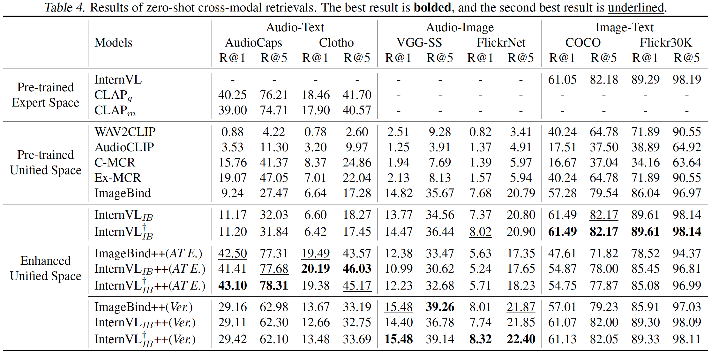
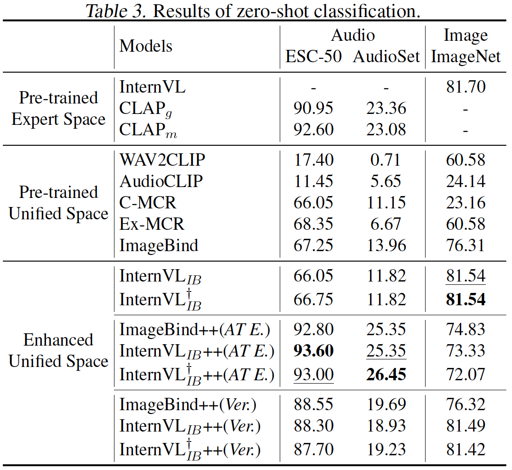

<h2 align="center"> <a href="https://arxiv.org/pdf/2405.04883">【ICML 2024 🔥】Molecule-Space: Free Lunch in Unified Multimodal Space via Knowledge Fusion </a> </h2>

[**Zehan Wang**](https://zehanwang01.github.io/) · [**Ziang Zhang**](https://scholar.google.com/citations?user=DptGMnYAAAAJ) · [**Xize Cheng**](https://exgc.github.io/) · [**Rongjie Huang**](https://rongjiehuang.github.io/) · [**Luping Liu**](https://luping-liu.github.io/) · [**Zhenhui Ye**]() · [**Haifeng Huang**]() · [**Yang Zhao**]() · [**Tao Jin**]() · [**Peng Gao**]() · [**Zhou Zhao**]()

Molecule-Space is an efficient unified multimodal space enhancement strategy. Built upon ImageBind, we build an audio-visual-text representation that outperforms ImageBind by a large margin.

## News
- `2024/05/02`: MoleculeSpace is accepted by ICML2024.

## To-Do List
- [x] Inference code
- [x] Model zoo (audio-image-text)

Before 31th, May. Please stay tuned.

## Highlight

### Fast and efficient pre-trained unified space enhancement
Intergrating CLIPs, CLAPs to ImageBind brings comprehensively improved audio-image-text space.

### Flexible post-training customization
Adjusting the space combining factors results in spaces with different specialties. 

We provide two default settings, **_AT Expertise._** (Better audio-text version, surpass advanced CLAPs), and **_Versatile._** (Balanced version, state-of-the-art audio-image and image-text performance)


## Performance

Comparison on zero-shot cross-modal retrieval tasks: 

<p align="left">

</p>

Comparison on zero-shot classification tasks:

<p align="left">

</p>

## File structure
```
-assets
      [demo samples, including image and audio]
-checkpoints
      [pretrained weights for ImageBind, InternVL, CLAP and projectors]
-models
      projectors.py                 [the projector of MoleculeSpace]
      experts.py                    [base feature extractors]
      uni_spaces.py                 [combine projector and experts together]
      imagebind_audio.py            [imagebind audio branch for finetune]
      paths.py
      type.py
```

## Usage
### 1. install enviornments
Install pytorch 1.13+ and other 3rd party dependencies.
```shell
conda create -n molecule python=3.8
conda activate molecule
pip install -r requirements.txt
```

To install ImageBind in this environment, you should clone the [ImageBind repository](https://github.com/facebookresearch/ImageBind), then follow the guide in the repo.

### 2. download checkpoints
The pretrained weights of feature extractors and projectors are shown below. You need to download the weights for **CLAP** and **InternVL-14B** and put them in directory `checkpoints` and renamed them. The weights for **Imagebind** will be downloaded automatically during the first running.

- **Projectors**: Molecular projecotrs, we provide pretrained weights on [huggingface](https://huggingface.co/Viglong/Molecule) with **ImageBind++**, **InternVL$`_{IB}`$++** and **InternVL$`_{IB}^{\dagger}`$++**

- **CLAP**：Audio-Language experts, you can find the repository [here](https://github.com/LAION-AI/CLAP) and you can download the CLAP-General weight we use [here](https://huggingface.co/lukewys/laion_clap/blob/main/630k-fusion-best.pt) and the CLAP-Music weight [here](https://huggingface.co/lukewys/laion_clap/blob/main/music_speech_audioset_epoch_15_esc_89.98.pt). We also provided the checkpoints with [our projectors](https://huggingface.co/Viglong/Molecule).
  
    > Note: the version of the package `transformers` should not be higher than **4.30.2**, otherwise the weight of CLAP's text branch may not be loaded in correctly.
- **InternVL-14B**：Vision Language Foundation Model, you can find the repository [here](https://huggingface.co/OpenGVLab/InternVL-14B-224px) and you can download its weight by `git lfs clone` command.


The final structure of `checkpoints` should be like this:
```
-checkpoints
    -InternVL_IB_Proj
        -A
            best.pt
        -AT
        -AV
        ...
    -InternVL_IB_FTPP_G_Proj
    -InternVL_IB_FTPP_M_Proj
    -InternVL_IB_PP_G_Proj
    -InternVL_IB_PP_M_Proj
    -IB_PP_G_Proj
    -IB_PP_M_Proj
    -InternVL-14B-224px
    DrvtFT_audio_with_head.pt                       [finetuned ImageBind audio encoder]
    laion_clap_fullset_fusion.pt                    [CLAP_General's weight]
    music_speech_audioset_epoch_15_esc_89.98.pt     [CLAP_Music's weight]
```

### 3. Inference

Extract and compare embeddings in different MoleculeSpaces:
```python
from models.paths import *
import torch
from models.uni_spaces import Uni_Spaces, ImageBind, IB_PP, InternVL_IB, InternVL_IB_PP, InternVL_IB_FT, InternVL_IB_FT_PP

# device = 'cuda:0' if torch.cuda.is_available() else 'cpu'
device = 'cpu'
def uni_example(uni: Uni_Spaces):
    audios = ['assets/BBQ.wav', 'assets/toilet.wav', 'assets/train.wav']
    images = ['assets/BBQ.jpeg', 'assets/toilet.jpeg', 'assets/train.jpeg']
    texts  = ['an audio of barbeque', 'an audio of toilet', 'an audio of train']
    ## Adjusting the space combining factors results in spaces with different specialties.
    ## Versatile.
    uni.text_factor=0.1
    uni.audio_factor=0.5
    text_embs  = uni.emb_texts(texts)
    audio_embs = uni.emb_audios(audios)
    image_embs = uni.emb_images(images)

    print("Audio x Image:\n",
        torch.softmax(audio_embs@image_embs.T * 10.0, dim=-1)
    )
    print("Audio x Text:\n",
        torch.softmax(audio_embs@text_embs.T * 10.0, dim=-1)
    )
    print("Image x Text:\n",
        torch.softmax(image_embs@text_embs.T * 10.0, dim=-1)
    )

    ## AT Expertise.
    uni.text_factor=0.5
    uni.audio_factor=0.8

    text_embs  = uni.emb_texts(texts)
    audio_embs = uni.emb_audios(audios)
    image_embs = uni.emb_images(images)

    print("Audio x Image:\n",
        torch.softmax(audio_embs@image_embs.T * 10.0, dim=-1)
    )
    print("Audio x Text:\n",
        torch.softmax(audio_embs@text_embs.T * 10.0, dim=-1)
    )
    print("Image x Text:\n",
        torch.softmax(image_embs@text_embs.T * 10.0, dim=-1)
    )

uni = IB_PP()
uni = uni.to(device)
print('----IBPP----')
uni_example(uni)

uni = InternVL_IB_FT_PP()
uni = uni.to(device)
print('----InternVL_IB_FT_PP----')
uni_example(uni)

# Expected output
# ----IBPP----
# Audio x Image:
#  tensor([[0.7426, 0.1838, 0.0736],
#         [0.0456, 0.9197, 0.0347],
#         [0.0736, 0.0837, 0.8427]], device='cuda:0')
# Audio x Text:
#  tensor([[0.7238, 0.2097, 0.0665],
#         [0.0124, 0.9691, 0.0185],
#         [0.0446, 0.0981, 0.8573]], device='cuda:0')
# Image x Text:
#  tensor([[0.6406, 0.1846, 0.1748],
#         [0.1061, 0.8104, 0.0835],
#         [0.1736, 0.1662, 0.6602]], device='cuda:0')
# Audio x Image:
#  tensor([[0.7371, 0.1669, 0.0960],
#         [0.0357, 0.9237, 0.0406],
#         [0.0641, 0.0967, 0.8392]], device='cuda:0')
# Audio x Text:
#  tensor([[0.6880, 0.2722, 0.0398],
#         [0.0021, 0.9925, 0.0054],
#         [0.0079, 0.0324, 0.9596]], device='cuda:0')
# Image x Text:
#  tensor([[0.6530, 0.2016, 0.1454],
#         [0.0669, 0.8922, 0.0409],
#         [0.1440, 0.1134, 0.7426]], device='cuda:0')

# ----InternVL_IB_FT_PP----
# Audio x Image:
#  tensor([[0.6601, 0.2232, 0.1167],
#         [0.0568, 0.8933, 0.0499],
#         [0.0873, 0.1187, 0.7941]], device='cuda:0')
# Audio x Text:
#  tensor([[0.7360, 0.1836, 0.0804],
#         [0.1283, 0.7124, 0.1593],
#         [0.1276, 0.1832, 0.6893]], device='cuda:0')
# Image x Text:
#  tensor([[0.5094, 0.2608, 0.2298],
#         [0.1742, 0.6009, 0.2249],
#         [0.2390, 0.2895, 0.4715]], device='cuda:0')
# Audio x Image:
#  tensor([[0.6730, 0.2183, 0.1087],
#         [0.0376, 0.9099, 0.0525],
#         [0.0864, 0.2038, 0.7098]], device='cuda:0')
# Audio x Text:
#  tensor([[0.6963, 0.2787, 0.0250],
#         [0.0101, 0.9784, 0.0115],
#         [0.0324, 0.0571, 0.9105]], device='cuda:0')
# Image x Text:
#  tensor([[0.5324, 0.2517, 0.2159],
#         [0.0732, 0.8440, 0.0828],
#         [0.1844, 0.2028, 0.6128]], device='cuda:0')
```
## Citation
If you find this project useful, please consider giving a star and citation:

```bibtex
@misc{wang2024moleculespace,
      title={Molecule-Space: Free Lunch in Unified Multimodal Space via Knowledge Fusion}, 
      author={Zehan Wang and Ziang Zhang and Xize Cheng and Rongjie Huang and Luping Liu and Zhenhui Ye and Haifeng Huang and Yang Zhao and Tao Jin and Peng Gao and Zhou Zhao},
      year={2024},
      eprint={2405.04883},
      archivePrefix={arXiv},
      primaryClass={cs.CV}
}

@misc{wang2023extending,
      title={Extending Multi-modal Contrastive Representations}, 
      author={Zehan Wang and Ziang Zhang and Luping Liu and Yang Zhao and Haifeng Huang and Tao Jin and Zhou Zhao},
      year={2023},
      eprint={2310.08884},
      archivePrefix={arXiv},
      primaryClass={cs.CV}
}

@misc{wang2023connecting,
      title={Connecting Multi-modal Contrastive Representations}, 
      author={Zehan Wang and Yang Zhao and Xize Cheng and Haifeng Huang and Jiageng Liu and Li Tang and Linjun Li and Yongqi Wang and Aoxiong Yin and Ziang Zhang and Zhou Zhao},
      year={2023},
      eprint={2305.14381},
      archivePrefix={arXiv},
      primaryClass={cs.LG}
}
```
lf you have any questions or suggestions, feel free to drop us an email ( [wangzehan01@zju.edu.cn](wangzehan01@zju.edu.cn), [ziangzhang@zju.edu.cn](ziangzhang@zju.edu.cn) ) or open an issue.

## Acknowledgement
Thanks to the open source of the following projects: [InternVL](https://github.com/OpenGVLab/InternVL), [CLAP](https://github.com/LAION-AI/CLAP), [Imagebind](https://github.com/facebookresearch/ImageBind).
<!--
**MoleculeSpace/MoleculeSpace** is a ✨ _special_ ✨ repository because its `README.md` (this file) appears on your GitHub profile.

Here are some ideas to get you started:

- 🔭 I’m currently working on ...
- 🌱 I’m currently learning ...
- 👯 I’m looking to collaborate on ...
- 🤔 I’m looking for help with ...
- 💬 Ask me about ...
- 📫 How to reach me: ...
- 😄 Pronouns: ...
- ⚡ Fun fact: ...
-->
